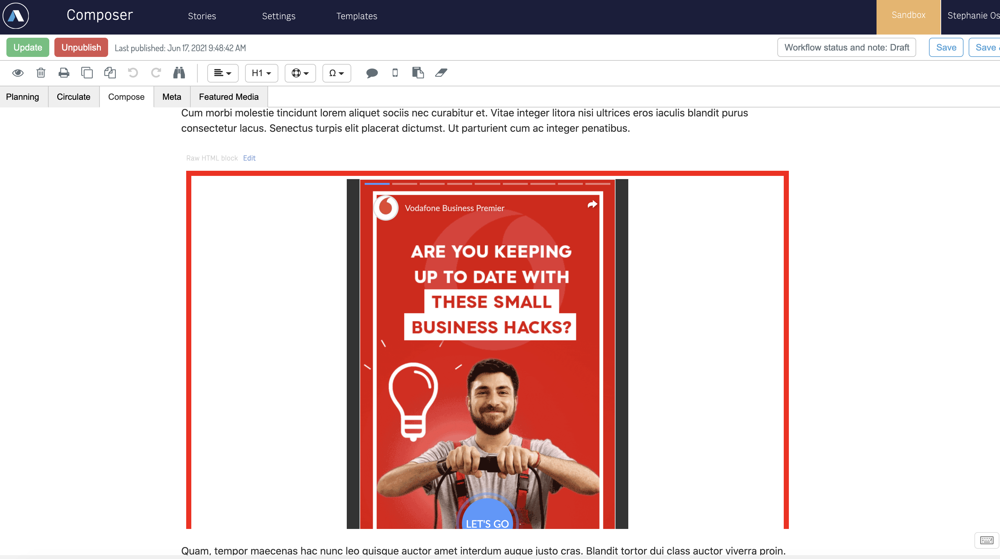
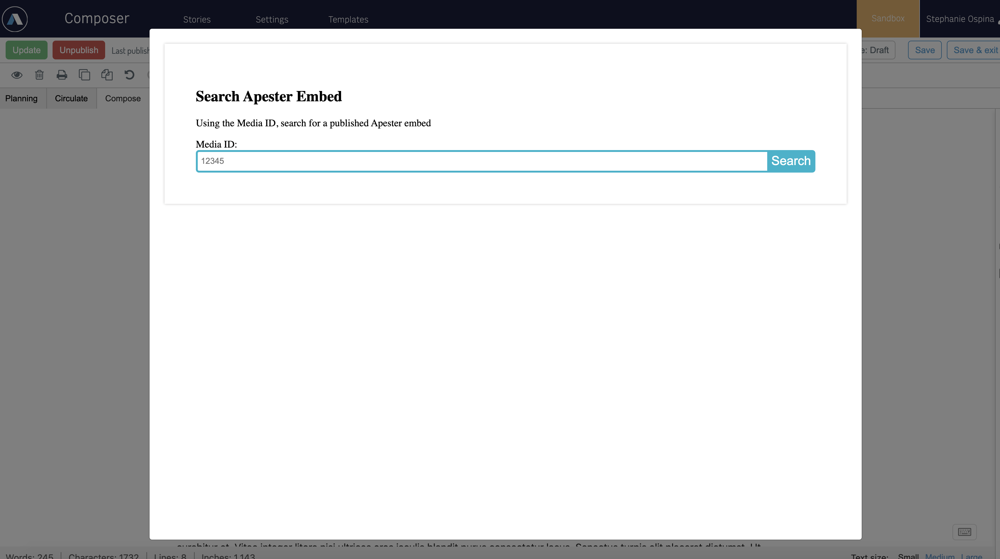

# Power-Ups Training

Welcome to the Power-Ups training! 

Before we start, let's review the definition of Power-Ups and the most common use cases.

## What are Power-Ups

Power-Ups are an expanded custom embed that allows Editors in Composer to interact with Third Party Content providers and/or create unique content not supported by existing Composer features.

#####  Note: We encourage organizations to use the embed HTML functionality that's available in Composer by default. Add Power-Ups only if necessary.

## Common Use Cases:

- Liveblogs
- Sports scoreboards
- Polls
- Audio
- External Video
- Quiz


## Example: 
Power-Up in Composer





&nbsp;

## About this training 

In this training, we are going to build a Power-Up for an [Apester Embed](https://apester.com/). For this example, even though editors can embed the HTML using the OOTB button to embed HTML in Composer, we want to give them the option to interact more with the content, that way without leaving Composer they'll be able to search and edit the embed.

In these labs we're going to build the three views that are required for each Power-Up: Search, View, and Edit, we're going to test it locally with Arc's testing tool, and finally, we're going to deploy our code and set up Composer to start using it. [click here](https://apester.com/) to learn more about Apester!


## About the labs

This repo contains one branch for each of the labs in the Power-Up training curriculum. Each branch builds off of the previously completed lab so you can check your solutions as you go. For example, to see the solution to lab 4, you can switch to the powerups-lab-05 branch since that's where lab 5 starts.

## Prerequisites

- Node version 10+
- Fusion CLI `npm i @arc-fusion/cli`
- VS Code - *There is a configuration and documentation set up specifically for this code editor so you'll have an easier time linting and formatting your work.*
- Docker desktop - *Update the memory allocated in the docker settings to ~8GB – without this update fusion will run very slowly and file watcher will likely break.*

## Installation and setup


If you already cloned down this repo, set up the .env file, and downloaded the PB data, checkout to the branch `powerups-lab-00` to get started. Otherwise, follow these steps:


1.  [Clone](https://git-scm.com/docs/git-clone) this repository and checkout to the `powerups-master` branch.


2. In the root directory, create a `.env` file based on the below .env example and fill in the relevant info.

    To get the Auth token:

    - Go to your org's Arc homepage and switch to the sandbox environment.
    - Click on Developer Center and click "create read-only token".
    - Fill in the fields and click create. This will create your access token.
    - Copy the content at the bottom where it says "Copy the following into your PB .env file if setting up PageBuilder" and place it into your .env. It should be something like this:

        ```
        ARC_ACCESS_TOKEN=xxx
        CONTENT_BASE=https://api.xxx.arcpublishing.com/

        ```


3. Next, you'll need to install dependencies for the feature pack. Run `npm i` to install dependencies for the feature pack.


4. Import the database from pb data. To mimic a deployed environment, go to your orgs Arc homepage, go to the sandbox environment and click on the PB data button which is under the `delivery` section. This will download a `file.tar.gz` (the file name should follow this naming convention). Copy that file into your feature pack's `data/restore/` folder. Then, when you run start, you can see pages from that setup to more closely match the selected environment.

5. Start the app!  `npx fusion start`


6. Wait until you see a webpack build success with files successfully built. Then you can go to http://localhost/pagebuilder/pages to see the output.


## Useful Commands

    `npx fusion rebuild`

- This forces a webpack rebuild of a running cluster. [Documentation](https://www.npmjs.com/package/@arc-fusion/cli#rebuild)

- Use this command if environment variables are not picked up by rebuild or if you need to restart the webpack container.

&nbsp;

## Curriculum Overview 

| branch   | topic covered | 
| :------: | :----------   |
| [lab-00](https://github.com/arc-partners/Fusion-Training-User-Stories/tree/powerups-lab-00) | Directory structure|
| [lab-01](https://github.com/arc-partners/Fusion-Training-User-Stories/tree/powerups-lab-01) | PostMessage API |
| [lab-02](https://github.com/arc-partners/Fusion-Training-User-Stories/tree/powerups-lab-02) | Parsing the query string |
| [lab-03](https://github.com/arc-partners/Fusion-Training-User-Stories/tree/powerups-lab-03) | Adding a new output-type |
| [lab-04](https://github.com/arc-partners/Fusion-Training-User-Stories/tree/powerups-lab-04) | The three views: Search |
| [lab-05](https://github.com/arc-partners/Fusion-Training-User-Stories/tree/powerups-lab-05) | The three views: Edit |
| [lab-06](https://github.com/arc-partners/Fusion-Training-User-Stories/tree/powerups-lab-06) | The three views: View |
| [lab-07](https://github.com/arc-partners/Fusion-Training-User-Stories/tree/powerups-lab-07) | Adding the conditional rendering |
| [lab-08](https://github.com/arc-partners/Fusion-Training-User-Stories/tree/powerups-lab-08) | Testing Power-Ups locally |
| [lab-9](https://github.com/arc-partners/Fusion-Training-User-Stories/tree/powerups-lab-09) | Deployment |
| [lab-10](https://github.com/arc-partners/Fusion-Training-User-Stories/tree/powerups-lab-10) | Composer settings |
| [lab-11](https://github.com/arc-partners/Fusion-Training-User-Stories/tree/powerups-lab-11) | Usage |


&nbsp;

# Now let's start!

## [Next up: Lab 00](https://github.com/arc-partners/Fusion-Training-User-Stories/tree/powerups-lab-00)
