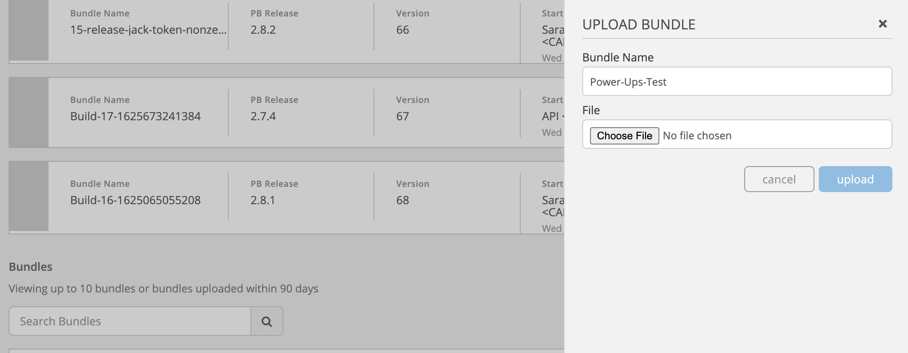

# Deployment

Now that we tested our implementation, it's time to deploy our code! Since we don't have an instance of Composer running locally, we need to use Composer in the Sandbox or Development environment.

# Deploy your code!

For testing purposes, we are not going to use the CI/CD pipeline, instead, we're going to do a manual deployment.

Before we deploy, choose the environment that you are going to use (Sandbox or Development) and communicate to your team that you're going to deploy a new bundle.

1. Go to your code editor and run `npx fusion zip` at the root of the project. Once it's done, go to the `dist` folder, you should see a zip file of the project
2. Go to your organization's dashboard
3. Under the delivery section click on Page Builder
4. In the top menu on Page Builder, click on `Developer tools` & click on `Deployer`
5. Take a note of the bundle that's currently deployed so we can deploy it back once we're done testing
6. Find the button that says `Upload bundle`. That's how we do manual deployments

7. Once you click on the `Upload bundle` button, add the name of the bundle and select the zip file of the project (step 1)

8. Click on `upload`
9. Once it's done, click on the three dots (small menu) on the right side of the bundle card and click on `deploy`
10. Once it's done click again on the three dots menu and click on promote, you'll see a confirmation pop-up, click `promote`
11. Now our bundle is `Live!`

 &nbsp;

## [Next up: Lab 10](https://github.com/arc-partners/Fusion-Training-User-Stories/tree/powerups-lab-10)
